# JSPX Web Framework

**"Web tier is no more a concern"**

JSPX is a free, open-source Java web framework that provides a business case driven, component-based approach to building modern web applications. It combines the power of Java with XML-based page definitions using standard HTML tags, offering features like master pages, AJAX support, data binding, validation, and enterprise-grade security.

**Current Version**: JSPX 2.1 | **License**: WTFPL (Do What The F*ck You Want To Public License)

## Table of Contents

1. [Overview](#overview)
2. [Key Features](#key-features)
3. [Architecture](#architecture)
4. [Component Model](#component-model)
5. [Request Processing Flow](#request-processing-flow)
6. [Page Lifecycle](#page-lifecycle)
7. [Data Binding and Bean Management](#data-binding-and-bean-management)
8. [AJAX Integration](#ajax-integration)
9. [Security Model](#security-model)
10. [Getting Started](#getting-started)
11. [Project Structure](#project-structure)
12. [Dependencies](#dependencies)
13. [UML Diagrams](#uml-diagrams)
14. [API Reference](#api-reference)
15. [Examples](#examples)

## Overview

JSPX is designed to simplify Java web development by providing a **business case driven** framework architecture similar to ASP.NET Web Forms but optimized for Java environments. Built on the philosophy of **"Develop Once, Run Everywhere"**, JSPX provides true portability across application servers with **zero configuration** requirements.

### Framework Philosophy

1. **Develop Once, Run Everywhere**: True portability across all Java application servers (tested on JBoss, OC4J, Tomcat, etc.)
2. **Web tier is no more a concern**: Abstracts web development complexity completely
3. **Full management on HTML**: Complete control over HTML generation using standard HTML tags
4. **No Magic**: Simple, transparent, understandable architecture - no hidden complexities
5. **Developer Friendly**: Clear error messages, intuitive development patterns

### Core Capabilities

- **HTML-Based Development**: Uses standard HTML tags with minimal custom extensions
- **Business-Oriented Controls**: Built around common business application patterns
- **Zero Configuration**: No XML configuration files required - works out of the box
- **JAAS Integration**: Enterprise-grade security with role-based access control
- **Modern UI Support**: Built-in jQuery, Bootstrap, and jQuery UI integration
- **Export Capabilities**: Native Excel export functionality
- **Migration Friendly**: Easy integration with existing JSP applications via `<jspinclude>`

## Key Features

### Ready-Packed Features (Official)

1. **Business Case Driven Framework**: Designed around common business development patterns
2. **HTML-Based Development**: Standard HTML tags with minimal custom extensions
3. **Web Forms Architecture**: Built around HTML form-based interactions with automatic script injection
4. **Native AJAX Support**: `<ajaxPanel>` wrapping for seamless partial updates, even with file uploads
5. **Comprehensive Validators**: Client and server-side validation with Custom AJAX validators
6. **DataTable/ListTable**: Rich data presentation controls with built-in CRUD operations
7. **JAAS Integration**: Java Authentication and Authorization Service ready with role-based security
8. **JSP Migration**: `<jspinclude>` for importing existing JSP files into JSPX applications
9. **Captcha Support**: Built-in CAPTCHA validation controls
10. **Export Capabilities**: Native Excel export functionality

### JSPX 2.1 New Features

- **Enhanced DataColumn**
  - Long text wrapping with modal display (`longtext` attribute)
  - Hint attributes for header tooltips
  - Decimal formatting for number display
  - Column ordering matching UI in Excel export

- **Advanced AJAX**
  - Override default Ajax submitters (`ajaxsubmitter` attribute)
  - Cross-panel refresh: AjaxPanel can trigger other panels to refresh
  - Request URI available in JEXL context (`request.uri`)

- **XmlBean Introduction**: New bean type for XML data handling
- **ListTable Enhancements**: Column sorting capabilities added
- **Enhanced Security**: Role-based DataParam exclusion from SQL formatting
- **Performance Improvements**
  - 5-minute default timeout on SQL statements in DAO
  - Improved Excel export with proper column ordering

- **Developer Experience**
  - Runtime validator creation via `validate` attribute on inputs
  - Loading indicators for links (`data-load-img` attribute)
  - Improved EL expression parsing
  - Better duplicate event handling

### Framework Architecture
- **Servlet-based**: Built on standard Java Servlet API 2.5+
- **Zero Configuration**: No XML configuration files required
- **Page Lifecycle**: 11-stage lifecycle with comprehensive event hooks
- **Template System**: Master/Content pages with inheritance
- **Expression Language**: Full JEXL 2.1.1 integration for data binding
- **Component Library**: Comprehensive set of business-oriented web controls

### Modern Web Integration
- **jQuery 1.8.3**: DOM manipulation and AJAX functionality
- **Twitter Bootstrap**: Responsive UI framework integration  
- **jQuery UI 1.9.1**: Enhanced widgets and interactions
- **jQuery Plugins**: Rating, notifications, masked input, live query, hotkeys

### Enterprise Capabilities
- **JAAS Security**: Role-based access control at page and control level
- **AllowedRoles/DeniedRoles**: Declarative security attributes
- **Simulated Action Protection**: Server-side role verification for security
- **Table Security**: Automatic CRUD permission checking
- **Input Sanitization**: Built-in XSS and security protection
- **Internationalization**: Multi-language resource bundle support
- **JMX Monitoring**: Runtime administration and monitoring beans
- **Caching**: Page model and resource optimization

## Architecture

### High-Level Architecture

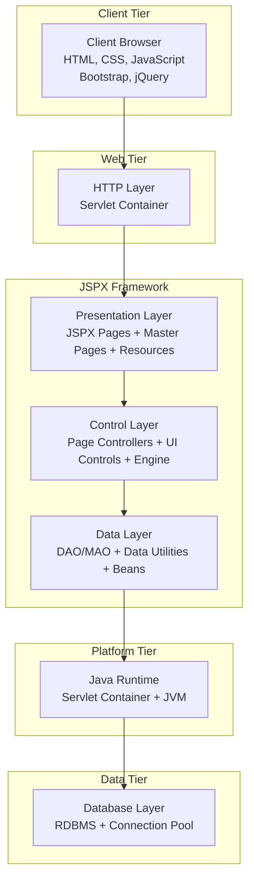

### Package Structure

```
eg.java.net.web.jspx/
├── engine/                           # Core framework engine
│   ├── RequestHandler                # Main servlet and request processor
│   ├── annotation/                   # Framework annotations (@JspxBean, @JspxWebControl)
│   ├── data/                         # Data access and utilities (DAO/MAO patterns)
│   ├── el/                           # Expression language support (JEXL integration)
│   ├── error/                        # Exception handling and error management
│   ├── jmx/                          # JMX monitoring beans for runtime admin
│   ├── message/                      # User messaging system
│   ├── parser/                       # XML parsing and page composition
│   └── util/                         # Utility classes and helpers
└── ui/                               # User interface components
    ├── controls/                     # Base control classes
    │   ├── WebControl                # Abstract base class for all controls
    │   ├── attrbs/                   # Attribute handling (JspxAttribute)
    │   ├── html/                     # HTML element controls
    │   │   ├── elements/             # Form, Panel, Label, Image, etc.
    │   │   ├── inputs/               # Input controls (TextBox, Button, etc.)
    │   │   └── ajax/                 # AJAX-enabled controls
    │   └── validators/               # Validation controls
    │       ├── RequiredFieldValidator
    │       ├── EmailValidator
    │       ├── LengthValidator
    │       └── CustomValidator
    └── pages/                        # Page model classes
        ├── Page                      # Base page class
        ├── ContentPage               # Content page with master support
        ├── MasterPage                # Master page template
        └── PortletPage               # Embeddable page component
```

## Component Model

### WebControl Hierarchy

```
WebControl (Abstract Base)
├── GenericWebControl
│   ├── Form                          # HTML form container with postback handling
│   ├── Panel                         # Generic container control
│   ├── Label                         # Text display control
│   ├── Image                         # Image display control
│   ├── HyperLink                     # Navigation link control
│   ├── ContentHolder                 # Master page content placeholder
│   └── PlaceHolder                   # Dynamic content placeholder
│
├── Input Controls
│   ├── TextBox                       # Single-line text input
│   ├── Password                      # Password input field
│   ├── TextArea                      # Multi-line text input
│   ├── CheckBox                      # Boolean checkbox input
│   ├── RadioButton                   # Single-choice radio button
│   ├── RadioButtonGroup              # Grouped radio buttons
│   ├── Button                        # Clickable button control
│   ├── LinkCommand                   # Server-side link button
│   ├── FileUpload                    # File upload control
│   └── Hidden                        # Hidden form field
│
├── Selection Controls
│   ├── Select (DropDown)             # Single-choice dropdown list
│   ├── ListBox                       # Multi-choice list control
│   └── AutoComplete                  # AJAX-enabled text input with suggestions
│
├── Data Controls
│   ├── DataTable                     # Rich data grid with CRUD operations
│   ├── ListTable                     # Simple data list display
│   ├── Repeater                      # Template-based data repeater
│   └── DataModel                     # Object-to-control data binding
│
├── Validation Controls
│   ├── RequiredFieldValidator        # Required field validation
│   ├── EmailValidator                # Email format validation
│   ├── LengthValidator               # String length validation
│   ├── NumericValidator              # Numeric value validation
│   ├── RangeValidator                # Value range validation
│   ├── MSISDNValidator               # Mobile number validation
│   └── CustomValidator               # AJAX-enabled custom validation
│
├── AJAX Controls
│   ├── AjaxPanel                     # Partial page update container
│   └── AjaxSubmitter                 # AJAX form submission control
│
├── Special Controls
│   ├── Calendar                      # Date picker control
│   ├── JCal                          # Advanced calendar widget
│   ├── Captcha                       # CAPTCHA validation control
│   ├── Rate                          # Star rating control
│   ├── CollapsePanel                 # Collapsible content panel
│   └── ResourceBundle                # Internationalization support
│
└── Layout Controls
    ├── FieldSet                      # Form field grouping
    └── Div                           # Generic HTML div container
```

### Page Model Hierarchy

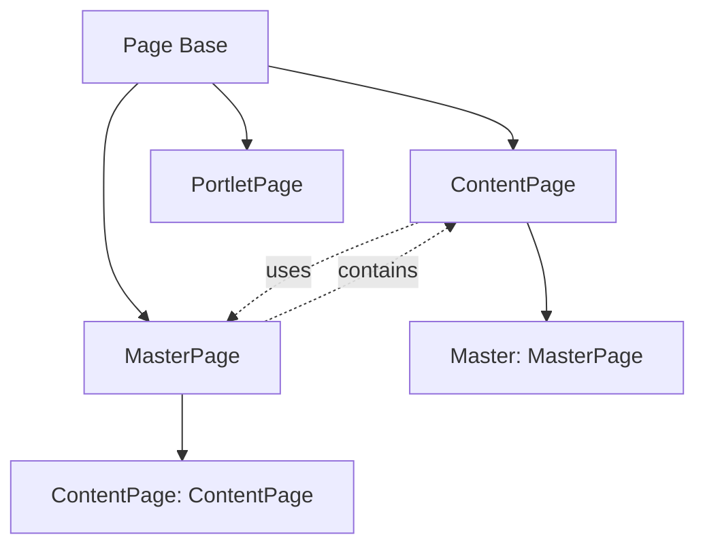

## Request Processing Flow

### Complete Request Flow Diagram

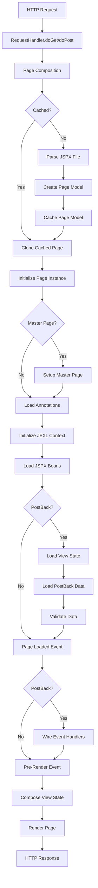

### Detailed Processing Steps

1. **Request Reception**: RequestHandler servlet receives HTTP request
2. **Page Composition**: Parse JSPX file or retrieve from cache
3. **Page Instantiation**: Create new page instance from cached model
4. **Context Initialization**: Set up request, response, session contexts
5. **Bean Management**: Initialize and inject annotated beans
6. **PostBack Processing**: Handle form submissions and view state
7. **Event Handling**: Execute server-side event methods
8. **Rendering**: Generate HTML output with controls
9. **Response**: Send complete HTML to client

## Page Lifecycle

### Lifecycle Stages

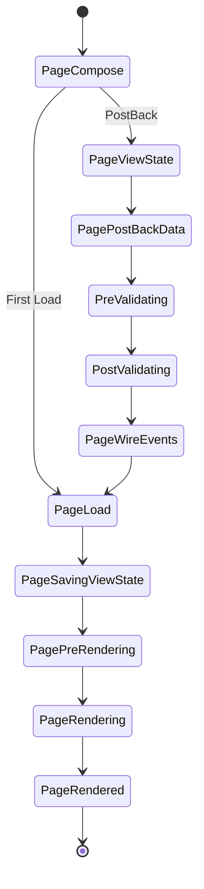

### Lifecycle Events

| Stage | Description | Methods Called |
|-------|-------------|----------------|
| **PageCompose** | Parse XML and create page model | Page creation, control instantiation |
| **PageViewState** | Restore control state from postback | `loadViewState()` |
| **PagePostBackData** | Extract form data and bind to controls | `loadPostBackData()` |
| **PreValidating** | Before validation | `preValidate()` |
| **PostValidating** | After validation | `postValidation()` |
| **PageWireEvents** | Process user interactions | Event handler methods |
| **PageLoad** | Page fully loaded | `pageLoaded()` |
| **PageSavingViewState** | Prepare view state for next request | `composeViewState()` |
| **PagePreRendering** | Before rendering | `pagePreRender()` |
| **PageRendering** | Generate HTML output | `render()` methods |
| **PageRendered** | After rendering complete | `pageRendered()` |

## Data Binding and Bean Management

### Bean Scopes

JSPX provides three bean scopes for managed objects:

```java
@JspxBean(name="userBean", scope=JspxBean.REQUEST)
private UserData userData;

@JspxBean(name="shoppingCart", scope=JspxBean.SESSION) 
private ShoppingCart cart;

@JspxBean(name="wizard", scope=JspxBean.CONVERSATION)
private WizardData wizardState;
```

| Scope | Lifetime | Use Case |
|-------|----------|----------|
| **REQUEST** | Single request | Form data, temporary objects |
| **SESSION** | User session | User preferences, authentication |
| **CONVERSATION** | Multi-request flow | Wizards, multi-step processes |

### Data Binding Patterns

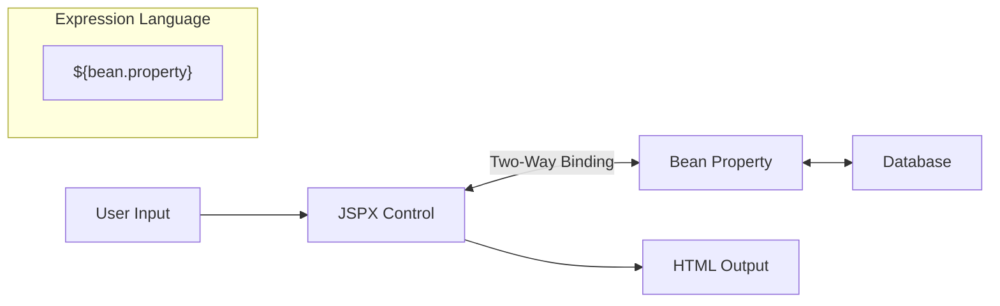

## AJAX Integration

### AjaxPanel Architecture

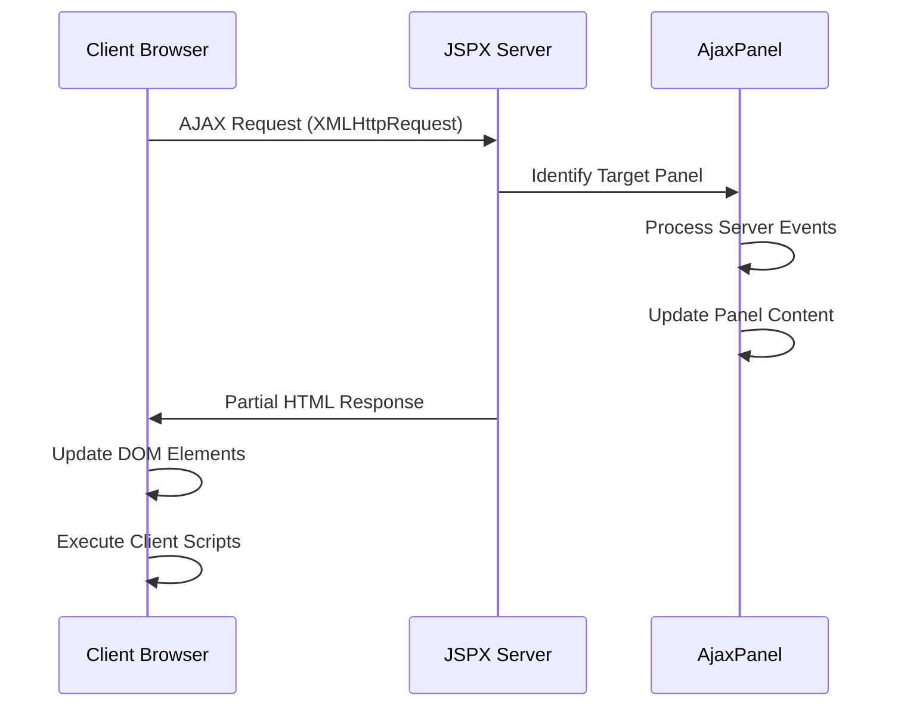

### AJAX Features

- **Partial Page Updates**: Update specific page regions without full reload
- **View State Synchronization**: Maintain page state during AJAX calls
- **Client-Server Events**: Seamless server method invocation
- **Auto-Refresh**: Configurable automatic panel updates
- **Progress Indicators**: Built-in loading states

## Security Model

### Multi-Layer Security

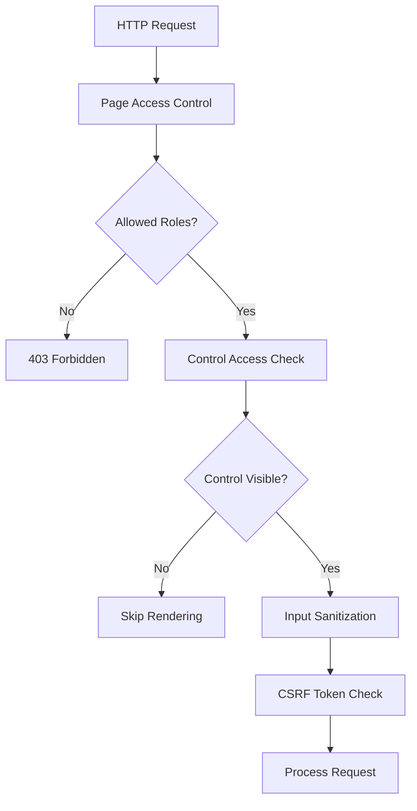

### Security Features

- **Role-Based Access Control**: Page and control-level security
- **Input Sanitization**: XSS prevention and data cleaning
- **CSRF Protection**: View state token validation
- **Session Security**: Secure conversation scoping

## Getting Started

### Prerequisites

- **Java 1.5+** (Java 8+ recommended for optimal performance)
- **Servlet Container**: Tomcat 7+, Jetty, JBoss, OC4J, or any compliant container
- **Build Tools**: Maven 3.x or Ant (optional for building from source)
- **Basic Knowledge**: HTML and Java fundamentals

### Installation

#### Option 1: Download Official Release

1. **Download JSPX 2.1**
   - Visit: http://jspx.sourceforge.net/pages/build/download.html
   - Download `jspx-2.1.jar`

2. **Add Required Dependencies**
   ```xml
   <!-- Required JARs for full functionality -->
   <dependency>
       <groupId>org.apache.poi</groupId>
       <artifactId>poi</artifactId>
       <version>3.9</version>
   </dependency>
   <dependency>
       <groupId>commons-fileupload</groupId>
       <artifactId>commons-fileupload</artifactId>
       <version>1.2.1</version>
   </dependency>
   <dependency>
       <groupId>org.apache.commons</groupId>
       <artifactId>commons-jexl</artifactId>
       <version>2.1.1</version>
   </dependency>
   <dependency>
       <groupId>commons-io</groupId>
       <artifactId>commons-io</artifactId>
       <version>1.3.2</version>
   </dependency>
   <dependency>
       <groupId>org.slf4j</groupId>
       <artifactId>slf4j-api</artifactId>
       <version>1.7.2</version>
   </dependency>
   <!-- Optional: SLF4J bridge for Commons Logging -->
   <dependency>
       <groupId>org.slf4j</groupId>
       <artifactId>jcl-over-slf4j</artifactId>
       <version>1.7.5</version>
   </dependency>
   ```

#### Option 2: Build from Source

1. **Clone the Repository**
   ```bash
   git clone https://github.com/eigonic/jspx.git
   cd jspx
   ```

2. **Build with Maven**
   ```bash
   mvn clean compile package
   ```

3. **Or Build with Ant**
   ```bash
   ant compile jar
   ```

### Configuration (Zero Config Required!)

**Configure web.xml** (Only servlets need registration):

```xml
<!-- JSPX Request Handler -->
<servlet>
    <display-name>JspxHandler</display-name>
    <servlet-name>JspxHandler</servlet-name>
    <servlet-class>eg.java.net.web.jspx.engine.RequestHandler</servlet-class>
</servlet>

<!-- JSPX Resource Handler (for embedded resources) -->
<servlet>
    <display-name>ResourceHandler</display-name>
    <servlet-name>ResourceHandler</servlet-name>
    <servlet-class>eg.java.net.web.jspx.engine.ResourceHandler</servlet-class>
</servlet>

<!-- Servlet Mappings -->
<servlet-mapping>
    <servlet-name>JspxHandler</servlet-name>
    <url-pattern>*.jspx</url-pattern>
</servlet-mapping>
<servlet-mapping>
    <servlet-name>ResourceHandler</servlet-name>
    <url-pattern>/jspxEmbededResources/*</url-pattern>
</servlet-mapping>
```

### Basic Usage

#### 1. Simple "Hello JSPX" Example

**hello.jspx**
```xml
<?xml version="1.0" encoding="UTF-8"?>
<page controller="com.example.HelloController">
    <html>
        <body>
            <label id="message"></label>
        </body>
    </html>
</page>
```

**HelloController.java**
```java
package com.example;

import eg.java.net.web.jspx.engine.annotation.JspxWebControl;
import eg.java.net.web.jspx.ui.controls.html.elements.Label;
import eg.java.net.web.jspx.ui.pages.Page;

public class HelloController extends Page {
    
    @JspxWebControl(name = "message")
    Label msg;

    @Override
    protected void pageLoaded() {
        msg.setValue("Hello JSPX from Java controller!");
    }
}
```

#### 2. Interactive Form Example

**form.jspx**
```xml
<?xml version="1.0" encoding="UTF-8"?>
<page controller="com.example.FormController">
    <html>
        <body>
            <form id="mainForm">
                <label>Name:</label>
                <input type="text" id="nameInput" value="${name}" />
                <input type="submit" value="Submit" onServerClick="handleSubmit" />
                <label id="messageLabel" text="${message}" />
            </form>
        </body>
    </html>
</page>
```

**FormController.java**
```java
public class FormController extends Page {
    @JspxBean(name="name", scope=JspxBean.REQUEST)
    private String name = "";
    
    @JspxBean(name="message", scope=JspxBean.REQUEST)  
    private String message = "";
    
    @JspxWebControl(name="nameInput")
    private Input nameInput;
    
    public void handleSubmit(WebControl sender, String args) {
        message = "Hello " + name + "!";
    }
}
```

#### 3. JAAS Security Example

**secure.jspx**
```xml
<form id="adminForm">
    <input id="resetButton" type="button" 
           onServerClick="resetPassword" 
           value="Reset Password" 
           allowedRoles="admin,super" />
           
    <input id="deleteButton" type="button" 
           onServerClick="deleteUser" 
           value="Delete User" 
           deniedRoles="guest" />
</form>
```

### Live Demo

Try JSPX online: **http://jspx-demo.appspot.com/**

## Project Structure

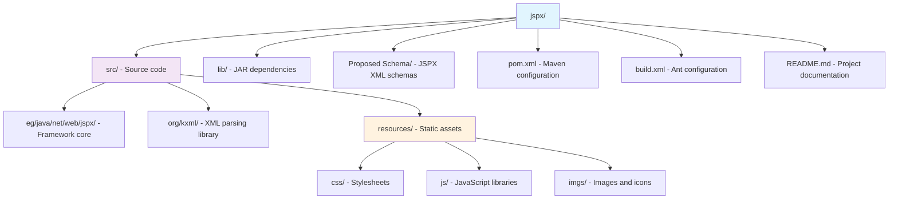

## Dependencies

### Core Dependencies

| Library | Version | Purpose |
|---------|---------|---------|
| **Servlet API** | 2.5+ | Web container integration |
| **Apache Commons JEXL** | 2.1.1 | Expression language |
| **Apache POI** | 3.12 | Excel file generation |
| **Commons FileUpload** | 1.3.1 | File upload handling |
| **SLF4J** | 1.7.12 | Logging abstraction |
| **Apache PDFBox** | 1.8.10 | PDF processing |

### Client-Side Dependencies

| Library | Version | Purpose |
|---------|---------|---------|
| **jQuery** | 1.8.3 | DOM manipulation and AJAX |
| **jQuery UI** | 1.9.1 | UI widgets and effects |
| **Bootstrap** | 3.x | Responsive CSS framework |

## UML Diagrams

### Core Class Diagram

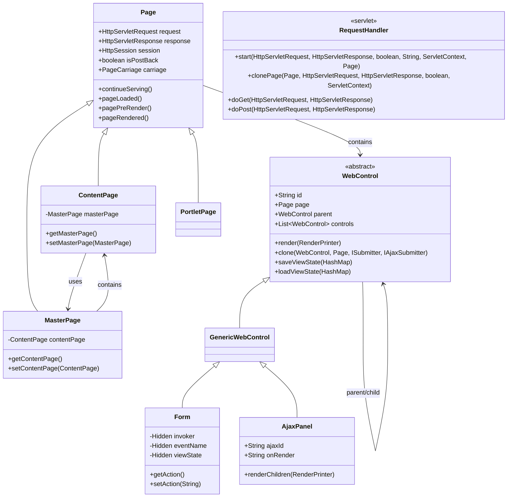

### Request Processing Sequence

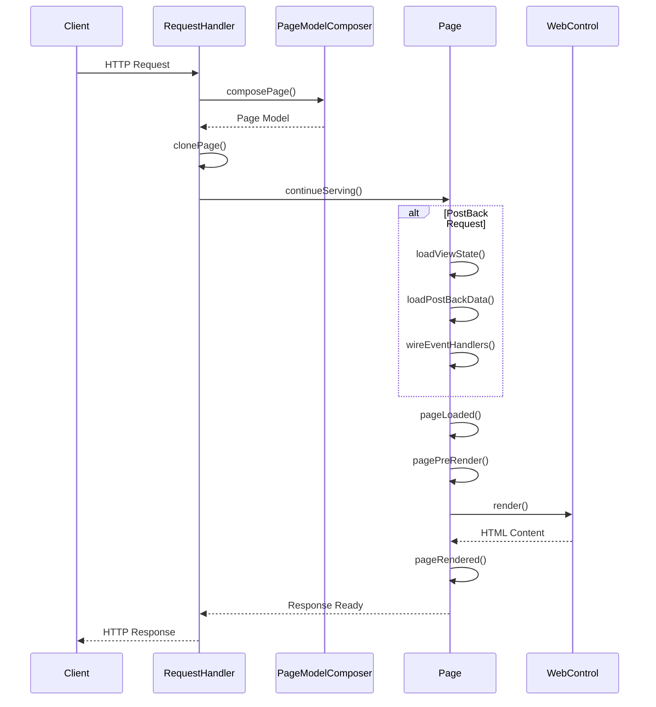

### Bean Management Activity Diagram

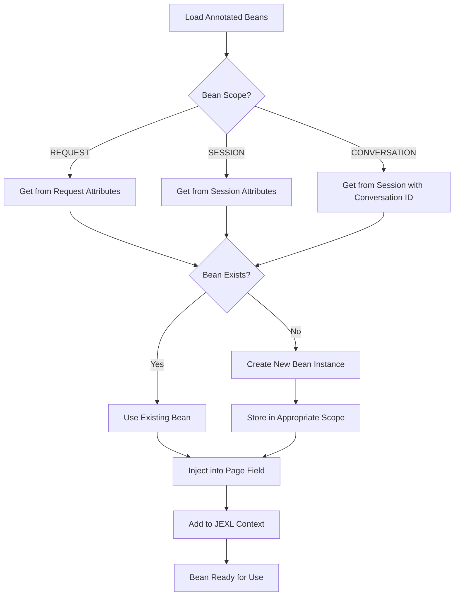

## API Reference

### Core Classes

#### Page Class
Base class for all JSPX pages providing lifecycle management and control access.

**Key Methods:**
- `continueServing()` - Main request processing method
- `pageLoaded()` - Called after page is fully loaded
- `pagePreRender()` - Called before rendering begins
- `redirect(String location)` - Redirect to another page
- `dispatch(String newPage)` - Transfer to another page

#### WebControl Class
Abstract base class for all UI controls.

**Key Methods:**
- `render(RenderPrinter outputStream)` - Render control to output
- `clone(...)` - Create copy of control for new page instance
- `saveViewState(HashMap viewState)` - Save control state
- `loadViewState(HashMap viewState)` - Restore control state

#### RequestHandler Class
Main servlet that handles all JSPX requests.

**Key Methods:**
- `start(...)` - Process JSPX page request
- `clonePage(...)` - Create page instance from cached model

### Annotations

#### @JspxBean
Marks fields as managed beans with automatic injection.
```java
@JspxBean(name="userBean", scope=JspxBean.SESSION)
private UserData userData;
```

#### @JspxWebControl  
Marks fields as web controls for automatic binding.
```java
@JspxWebControl(name="submitButton")
private Button submitBtn;
```

#### @JspxClientMethod
Marks methods as callable from client-side JavaScript.
```java
@JspxClientMethod
public void clientCallableMethod() { ... }
```

## Examples

### Master Page Example

**Master.jspx**
```xml
<?xml version="1.0" encoding="UTF-8"?>
<jspx:page controller="com.example.MasterController"
           xmlns:jspx="http://jspx-bay.sourceforge.net/jspx.xsd">
    <html>
        <head>
            <title>${pageTitle}</title>
            <link rel="stylesheet" href="/css/site.css" />
        </head>
        <body>
            <div class="header">
                <h1>My Website</h1>
                <nav><!-- navigation menu --></nav>
            </div>
            <div class="content">
                <jspx:contentHolder id="MainContent" />
            </div>
            <div class="footer">
                <p>&copy; 2024 My Company</p>
            </div>
        </body>
    </html>
</jspx:page>
```

**Content.jspx**
```xml
<?xml version="1.0" encoding="UTF-8"?>
<jspx:page controller="com.example.ContentController"
           master="/Master.jspx"
           xmlns:jspx="http://jspx-bay.sourceforge.net/jspx.xsd">
    <jspx:contentHolder id="MainContent">
        <jspx:form id="contactForm">
            <jspx:label text="Name:" />
            <jspx:input type="text" id="nameField" value="${contact.name}" />
            
            <jspx:label text="Email:" />  
            <jspx:input type="text" id="emailField" value="${contact.email}" />
            
            <jspx:input type="submit" value="Submit" onServerClick="handleSubmit" />
        </jspx:form>
    </jspx:contentHolder>
</jspx:page>
```

### AJAX Example

**AjaxDemo.jspx**
```xml
<jspx:form id="mainForm">
    <jspx:ajaxPanel id="updatePanel" group="search">
        <jspx:label id="resultLabel" text="${searchResults}" />
        <jspx:repeater id="resultsList" itemlist="${items}" var="item">
            <div class="result-item">${item.title}</div>
        </jspx:repeater>
    </jspx:ajaxPanel>
    
    <jspx:input type="text" id="searchBox" value="${searchTerm}" />
    <jspx:input type="submit" value="Search" 
                onServerClick="performSearch" group="search" />
</jspx:form>
```

### Data Binding Example

```java
public class ProductController extends ContentPage {
    @JspxBean(name="product", scope=JspxBean.REQUEST)
    private Product product = new Product();
    
    @JspxWebControl(name="productForm")
    private Form productForm;
    
    @Override
    protected void pageLoaded() {
        if (!isPostBack) {
            // Load product data
            product = productService.getProduct(getQueryString("id"));
        }
    }
    
    public void saveProduct(WebControl sender, String args) {
        // Product object automatically populated from form
        productService.save(product);
        redirect("/products/list.jspx");
    }
}
```

---

## Official Resources

- **Official Website**: [http://jspx.sourceforge.net/](http://jspx.sourceforge.net/)
- **Live Demo**: [http://jspx-demo.appspot.com/](http://jspx-demo.appspot.com/)
- **Documentation**: [http://jspx.sourceforge.net/pages/tout/doc.html](http://jspx.sourceforge.net/pages/tout/doc.html)
- **Download**: [http://jspx.sourceforge.net/pages/build/download.html](http://jspx.sourceforge.net/pages/build/download.html)
- **Support**: [YouTube Channel](http://www.youtube.com/user/jspxSupport) | [SourceForge Forums](http://sourceforge.net/projects/jspx-bay/forums)
- **Getting Started**: [http://jspx.sourceforge.net/pages/tout/start.html](http://jspx.sourceforge.net/pages/tout/start.html)

**JSPX Framework v2.1** - A powerful, business case driven, component-based Java web framework for building modern web applications.

*"Web tier is no more a concern"*
